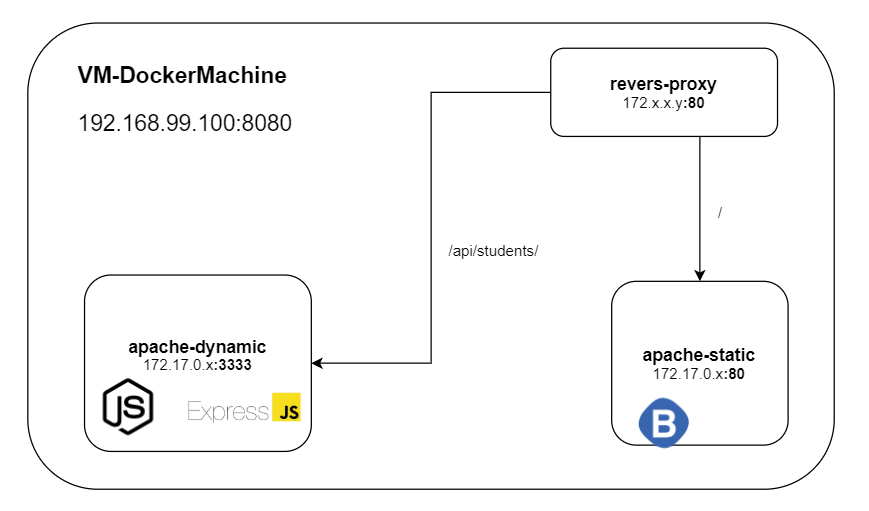

# Teaching-HEIGVD-RES-2020-Labo-HTTPInfra
# Documentation

## Objectifs

L'objectif de ce labo était de mettre en place **trois** serveurs, dockérisé, afin d'heberger une application web. L'idée est de séparer le contenu statique au contenu dynamique, et de passer par un reverse proxy pour accèdeder à l'application.
* Le premier serveur : ***apache-static*** , permet d'afficher du contenu HTML statique, à l'aide de **Bootstrap**.
* Le deuxième serveur : ***apache-dynamic***, fait tourner un serveur **Node.js**, et fournis une API qui permet de générer des noms, prénom, date de naissances. via une librairie Javascript, **Express**.
* Le troisième serveur : ***reverse-proxy*** , s'occupe de rediriger les requêtes HTTP entrantes sur les bons serveurs.




## apache-static

Pour apache-static, on utilise l'image php:5.6-apache.

Dockerfile :
```
FROM php:5.6-apache

RUN apt-get update && \
	apt-get install -y nano

COPY content/ /var/www/html/
```
On copie également tous le contenu de **content/** dans **/var/www/html** de la VM.

La configuration apache se trouve dans **/etc/apache2/sites-available/** :

```
<VirtualHost *:80>
	ServerAdmin webmaster@localhost
	DocumentRoot /var/www/html

	ErrorLog ${APACHE_LOG_DIR}/error.log
	CustomLog ${APACHE_LOG_DIR}/access.log combined
</VirtualHost>
```

Le contenu de /var/www/html contient une simple page d'acceuil statique, utilisant Bootstrap.

On y ajoute également un script,(docker-images\apache-php-image\content\js\,**students.js**):
```javascript
$(function () {
        console.log("Debut script students ok");
        function loadStudents(){
                $.getJSON("/api/students/api/students/", function( students ){
                        console.log("stud = " + students);
                        if(students.length > 0){
                                $(".student_title").text(students[0].firstName + " " + students[0].lastName);
                                                }
                                        });
                };
        loadStudents();
});
```

Ce script permet de récupérer des données via l'API que **apache-dynamic** fourni. On récupère ses données avec Ajax, puis utilisons JQuery pour modifier le titre de la page principale de index.html en affichant un nom récupéré des données.


## apache-dynamic

Le serveur apache-static fournit une API assez basique.
 - /api/students/ : retourne une liste de personnes (fictives) en format JSON.
 Le format est le suivant :
 ```JSON
[
	{
		"firstName": "",
		"lastName": "",
		"birthday": ""
	}
]
```
Les données sont aléatoires, générée par **Express.js**.


L'API fonctionne avec **Node.js**, qui se lance automatiquement au lancement de l'image Docker.
Pour ce faire, la Dockerfile comporte les lignes suivantes :

```Dockerfile

FROM node:6.0

RUN apt-get update && \
	apt-get install -y nano

COPY src /opt/app

CMD ["node", "/opt/app/index.js"]

```
On copie donc le contenu de notre application node.js dans /opt/app et lançons le serveur Node au démarrage du Docker.

N.B : la version 6.0 de Node est nécessaire pour utiliser **Express.js**. Sans quoi on se retrouve avec l'erreur suivante : 
```( SyntaxError: Block-scoped declarations (let, const, function, class) not yet supported outside strict mode)```

Le serveur Node.js est décrit de la manière suivante, et écoute sur le port **3333** :

```
var Chance = require('chance');
var chance = new Chance();
var express = require('express');
var app = express();


//Avec GET / HTTP/1.0
app.get('/api/students/', function(req, res){
	var students = [];
	for (var i = 0; i < 10; i++) {
		var gender = chance.gender();
		var birthday = chance.year({
			min: 1915,
			max: 2020
		})
		students.push({
			firstName: chance.first({
				gender : gender
			}),
			lastName : chance.last(),
			birthday: chance.birthday({
				year: birthday
			})
		});
	}
	res.send(students);
});

app.get('/test', function(req, res){
	res.send("Test is working! </br>");
});

app.listen(3333, function(){
	console.log("Accepting HTTP req. on port 3333")
})
```


## reverse-proxy

A ce stade, nous avons donc images Docker lancées. **apache-static** qui s'occupe de renvoyer du contenu HTML (Bootstrapé) statique et **apache-dynamic** qui fournit une API que **apache-static** appelle via son script javascript students.js.

Le container **reverse-proxy** s'occupera lui de rediriger selon le port, les requêtes entrantes :
 - 8080 -> 3333 : sur **apache-dynamic**
 - 8080 -> 80   : sur **apache-static**

Pour cela, nous devrons mapper les bonnes adresse IPs des deux autre containers, et cela de manière dynamique.

A la place de "hardcoder" les adresses IP des deux autres serveurs, nous allons générer dynamiquement le fichier de .conf du serveur.

Ainsi, lors du lancement du container (docker run), nous spécifierons les adresses IPs, à l'aide de la commande "-e".
Nous récupérons ensuite ses variables d'envrionnement dans le fichier (config-template.php)[/docker-images/apache-reverse-proxy/templates/config-template.php]

```php
<?php
	$ip_static_app = getenv('STATIC_APP');
	$ip_dynamic_app = getenv('DYNAMIC_APP');
?>
<VirtualHost *:80>
	ServerName demo.res.ch

	ProxyPass '/api/students/' 'http://<?php print "$ip_dynamic_app"?>/'
	ProxyPassReverse '/api/students/' 'http://<?php print "$ip_dynamic_app"?>/'

	ProxyPass '/' 'http://<?php print "$ip_static_app"?>/'
	ProxyPassReverse '/' 'http://<?php print "$ip_static_app"?>/'

</VirtualHost>
```

Lors du lancement du container de **reverse-proxy**, nous devons nous assurer que le fichier 001-reverse-proxy.conf sois générer dynamiquement, par php.

Pour se faire, nous utiliserons le fichier [apache2-foreground](/docker-images/apache-reverse-proxy/apache2-foreground), récupéré du [répertoire Git officiel](https://github.com/docker-library/php/blob/master/apache2-foreground).

Plus précisément, nous rajoutons les lignes suivantes :
```
# Add setup for RES lab
echo "Setup for the RES lab"
echo "Static app url : $STATIC_APP"
echo "Dynamic app url : $DYNAMIC_APP"
php /var/apache2/templates/config-template.php > /etc/apache2/sites-available/001-reverse-proxy.conf
```
Pour que **reverse-proxy** fonctionne correctement, il faut aussi activer deux modules Apache2 : **proxy** et **proxy_http**.
Puis également activer les fichiers de .conf.
Nous utilisons pour ce faire nous utilisons les commandes suivantes (dans le Dockerfile) :
```Dockerfile
RUN a2enmod proxy proxy_http
RUN a2ensite 000-* 001-*
```

On a donc finalement, le Dockerfile de **reverse-proxy** ressemblant à ça :
```Dockerfile
FROM php:5.6-apache

RUN apt-get update && \
	apt-get install -y nano

COPY apache2-foreground /usr/local/bin/
COPY templates /var/apache2/templates

COPY conf/ /etc/apache2

RUN a2enmod proxy proxy_http
RUN a2ensite 000-* 001-*

```

***Attention ! Il est important que le fichier apache2-foreground soit en format UNIX (LF) et non en Windows (CRLF) !***

(Il est possible de convertir le fichier depuis Notepad++)

## Build & Lancement des Docker Containers
### Builds
Pour le build des trois images, il faut se mettre dans le dossier ou se trouve le fichier Dockerfile correspondant.
Puis lancer la commandes suivantes :
```sh
docker build -t <nom de l'image qu'on veut donner> .
```

### Run
Les deux premiers container à lancer sont **apache-static** et **apache-dynamic** :
```sh
 docker run -d --name apache_static <nom de l'image apache-static>
 docker run -d --name apache_dynamic <nom de l'image apache-dynamic>
```
Puis il faut récupérer leur deux adresses IPs :
```sh
docker inspect apache_static | grep -i ipad
docker inspect apache_dynamic | grep -i ipad
```
On peut finalement lancer le **reverse-proxy**
```sh
docker run -e STATIC_APP=<adresse IP de apache_static>:80 -e DYNAMIC_APP=<adresse IP de apache_dynamic>:3333 -p 8080:80 --name reverse-proxy <nom de l'image du reverse proxy>
```
Dans cette dernière commande, on fait plusieurs choses :
 - "-e" : Set les variables d'environnement de la VM
 - "-p" : Mapping du port 8080 sur le 80.
 - "--name" : spécifie le nom du container
 
A partir de là, l'application est accessible à l'adresse : **192.168.99.100:8080** (si vous êtes sur Docker-machine).

### Modification du DNS
Il est aussi possible de modifier les redirections DNS de la machine client pour pouvoir accéder à notre application web sur l'adresse : **demo.res.ch**.

Pour ce faire, sur Windows, il faut modifier le fichier suivant : c:\windows\system32\drivers\etc\hosts (en mode admin)

Puis rajouter la ligne suivante : 192.168.99.100 demo.res.ch


## Autres commandes Docker utiles
```sh
//Connexion à "l'espace" docker-machine :
docker-machine ssh

//Se connecter au shell d'un container
docker exec -it -i <nom du container> /bin/bash

//Arrêter tous les containers
docker kill $(docker ps)

//Tuer les container "exited"
docker rm -v $(docker ps -a -q -f status=exited)

```


